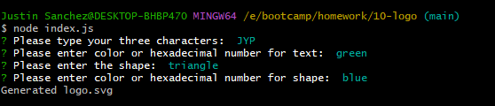
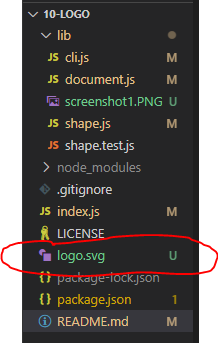

# logo-maker

## Description
The objective of this project is to generate a Scalable Vector Graphic (SVG) document that takes in users input and saved into a file called "logo.svg". The application will
prompt the user to choose the color of the shape, the shape (square, circle, and triangle), color of the text, and choosing 3 characters. 

## Technology Used
The project used Node.js, inqurier package version 8.2.4, and jest version 24.9.0

## Credits
Worked with Yi Jin during office hours to help me get started on how to create the svg document and helping with how to structure the project. 

## Testing
To run the test open up the terminal and type "node index.js". There the terminal will prompt four questions for the user to input.

After the user inputs the answers for the questions, the terminal will say "generated logo.svg" and then a svg file will open up

## Live-Recording
[Live Recording](https://drive.google.com/file/d/1EfMLpg1AVKcq9epXNoA1fxX-QDjMwidH/view)

## Notes to Grader
- 5/29: I was able to generate the logo.svg, but the shape would always come out as white so you could only see the text and text color. Also due to time restraint I wasn't able to finish the shape.test.js so I couldn't verify if it would pass. Finally, also due to time restraints I forgot to put a limit on the characters so the user could add more than three characters.  